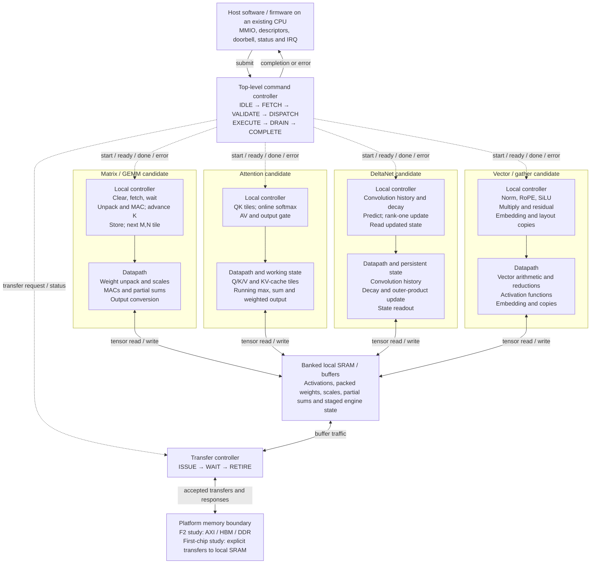

# Accelerator blocks and local controllers

Status: proposed architecture for investigation, September 22, 2026. This is an
editable transcription of the revised slide 9, not implemented RTL or an agreed
allocation of four independent compute engines. The Compute team will use this diagram and the Software evidence to research
which units are actually needed, including opportunities to share arithmetic.
The four boxes do not prescribe four independent engines.

Dotted arrows denote command/status relationships, not one-way electrical
signals. Solid bidirectional arrows denote tensor movement. The drawing does
not specify port counts, crossbar topology, cycle latency or simultaneous access.

## What changed from the slide

The source labels firmware as RISC-V. Here it is an existing host CPU: no custom
CPU, ISA or separate compiler team is required, and this drawing does not select
an ISA. The source's INT4 unpack, FP32 partial sums and BF16 writeback remain
**numerical candidates**, not validated formats. The recorded Q4_K_M model mixes
several GGUF tensor formats. The four engine boxes remain functional candidates;
shared matrix/vector primitives may serve more than one box.

The source proposes one command in flight and a 128-byte descriptor in ABI 0.1.
Those are comparison baselines, not a newly adopted binary interface. The
[register and descriptor maps](register-maps.md) preserve both slide tables for
Top-Level Control to refine using llama.cpp and the Software evidence. Control
and Memory will develop their own detailed block diagrams against this shared
system view; their interfaces should remain explicit proposals during research.

## Control and state responsibilities

| Boundary | Required design explanation |
|---|---|
| Host to command controller | What is accepted, when descriptors become immutable, completion identity, status/IRQ and acknowledgment |
| Command to local controller | Start acceptance, owned resources, local progress, result visibility and errors |
| Compute to memory | Layout, read/write arbitration, backpressure, accepted transactions and buffer release |
| Transfer to platform | Responses and outstanding traffic; a timeout does not cancel an accepted transfer |
| Persistent state | KV cache, recurrent state and convolution history belong to a request/sequence, unlike temporary GEMM partial sums |
| Fault/reset | Stop new issue, drain accepted traffic, report the error; reset only when quiescent in the source proposal |

Full persistent model/request state need not fit in local SRAM. Buffer placement
and state spilling are Memory/Compute questions. Double buffering only helps
when ports and dependencies permit actual overlap.

## Evidence and revision policy

The [llama.cpp report](https://github.com/SiliconBadgers/software/blob/main/experiments/llama-cpp/2026-09-22/REPORT.md)
motivates testing shared matrix arithmetic, including the output head. CPU time
shares do not allocate silicon area or establish the best compute split.
Use the [Software repository](https://github.com/SiliconBadgers/software) and
[profiling code and reproduction procedure](https://github.com/SiliconBadgers/software/tree/main/experiments/llama-cpp/2026-09-22)
to investigate concurrently. Compute researches the required compute units;
Control focuses on top-level control; Memory focuses on the memory controller.
All teams should refer to this central diagram instead of maintaining copies
of the overall architecture in their repositories.

Edit this Mermaid block when the design changes. Include the evidence, affected
state/interfaces and alternatives in the PR. Architecture maintains this shared
view; local controller/datapath diagrams live with their implementing teams.

Source: `Slide9-Accelerator-Control-Hierarchy.pptx`, slide 1 (displayed as slide 9),
and its speaker notes, revised September 21, 2026. It cites Technical Report
revision 3, pages 10–11, 14, 16 and 24–25. This document carries the usable diagram
and source assumptions so access to the local PowerPoint is not required.
