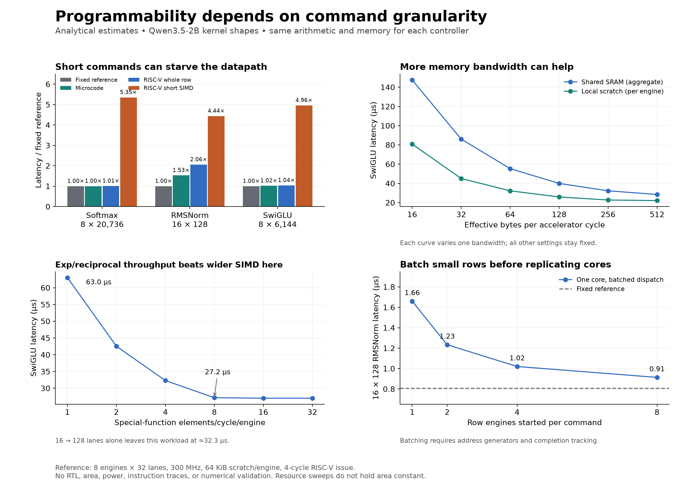

# Programmable vector control for Qwen3.5-2B

Architecture screening study • October 2, 2026

Status: exploratory evidence for [architecture #8](https://github.com/SiliconBadgers/architecture/issues/8) and the [RISC-V responsibility split](https://github.com/SiliconBadgers/architecture/issues/7). No core, ISA, shared interface, or compute partition is selected by this study.

A small RISC-V controller is a plausible way to program the vector engine. The important distinction is how much work each issued command starts. In this model, a command that processes a whole row has little overhead for long kernels. A core issuing a command for every short SIMD chunk can become the bottleneck. Small normalization rows are sensitive even to whole-row command overhead.

**These are analytical estimates, not measured CPU, FPGA, RTL, or llama.cpp performance.** The experiment compares hypothetical controllers using the same arithmetic and memory resources. It does not select a particular RISC-V core or establish an area winner.

## What was compared

| Design | What controls the vector datapath | Modeled issue cost |
|---|---|---|
| Fixed schedule | A fixed controller executes the chosen primitive sequence | Zero dispatch overhead; an ideal reference |
| Writable microcode | A local program sequences vector primitives | 2 cycles per primitive per engine |
| RISC-V, whole-row commands | Firmware issues a primitive over an entire row | 4 core cycles per primitive per engine |
| RISC-V, short SIMD commands | Firmware issues each lane-width chunk separately | 4 core cycles per chunk per engine |

The 2- and 4-cycle costs are sensitivity parameters, not measurements of an implementation. The fixed reference uses the same arithmetic sequence; it is not an optimized fused softmax circuit. Microcode is also programmable. The RISC-V option buys a familiar programming model and scalar control flow, not exclusive access to programmability.

The reference has eight vector engines, 32 lanes per engine, one controller at the same 300 MHz clock, 64 KiB scratch per engine, 64 effective scratch bytes/cycle/engine, 256 effective shared-SRAM bytes/cycle, and four special-function elements/cycle/engine. All vector temporaries are FP32. No whole-row command is assumed to process multiple rows unless explicitly stated.



## Results that change the architecture decision

### 1. Issue granularity matters more than the RISC-V label

Times below use conservative issue accounting: dispatch and datapath service add rather than overlap.

| Kernel workload | Fixed reference | Microcode | RISC-V whole row | RISC-V short SIMD |
|---|---:|---:|---:|---:|
| Softmax, 8 rows × 20,736 elements | 95.31 µs | 95.69 µs | 96.06 µs | 510.14 µs |
| RMSNorm, 16 rows × 128 elements | 0.81 µs | 1.23 µs | 1.66 µs | 3.58 µs |
| SwiGLU, 8 rows × 6,144 elements | 31.01 µs | 31.65 µs | 32.29 µs | 153.89 µs |

Whole-row RISC-V dispatch adds about **0.8%** to the long softmax workload, but about **106%** to the short head-normalization workload. The latter is small in absolute time but can repeat many times during prefill.

Allowing ideal dispatch/service overlap reduces the whole-row softmax estimate to 95.38 µs and the short-SIMD estimate to 414.96 µs. Therefore, the short-SIMD penalty is not solely an artifact of summing dispatch and execution. These are bounds within the same simplified schedule, not bounds on all possible hardware implementations.

This does **not** mean every SIMD or standard RVV implementation is slow. Hardware loops, instruction replay, wider architectural vectors, queues, and streaming operands can avoid the naive per-chunk issue pattern tested here.

### 2. Batch small rows before adding more CPU cores

For the 16 × 128 RMSNorm case, allowing one command to dispatch the same primitive to eight row engines reduces the whole-row RISC-V estimate from **1.66 to 0.91 µs**, with unchanged arithmetic and data traffic. Eight independent issuers achieve the same dispatch amortization in this model.

Batching requires real hardware: per-engine address generation, row counts/strides, completion tracking, and support for identical operations across those rows. It is not a free software change. This study does not model instruction replay across multiple waves of rows.

A useful implementation target is a command describing a primitive, source/destination addresses, vector length, row count, and strides. A local controller can then execute a kernel program without sending every primitive back through the system-level sequencer.

### 3. Wider SIMD alone does little under the reference bottlenecks

For eight 6,144-element SwiGLU rows, increasing lanes from 16 to 128 changes essentially nothing: about **32.29 µs** throughout. Special functions and memory service dominate this particular configuration.

Holding other resources fixed:

| Hardware change | SwiGLU time, before → after | Interpretation |
|---|---:|---|
| Special-function throughput: 1 → 4 elements/cycle/engine | 63.01 → 32.29 µs | Large benefit while exp/reciprocal service dominates |
| Special-function throughput: 4 → 8 | 32.29 → 27.17 µs | Further benefit, then other limits dominate |
| Shared SRAM: 64 → 256 effective bytes/cycle | 55.33 → 32.29 µs | Input/output traffic still matters with local scratch |
| Scratch capacity: 16 → 128 KiB/engine | 35.17 → 31.57 µs | Larger tiles reduce repeated setup; bandwidth still limits service |

These resource changes do not hold area or power constant. A throughput parameter of four means four accepted elements per cycle in the aggregate, not necessarily four physical units with a particular implementation.

Firmware can compose SwiGLU from reusable arithmetic, but a RISC-V core does not make exp, reciprocal, reductions, or memory movement free. If these run as scalar software routines instead of the assumed datapath primitives, the model must be changed.

### 4. Whole-model impact is smaller than the worst kernel penalty

Replacing supported vector-node timings in the existing Qwen3.5-2B graph gives the following exploratory change in phase time, relative to the same model with the fixed controller:

| Controller | 8,192-token prefill | Decode with 20,480 prior tokens |
|---|---:|---:|
| Writable microcode | +1.76% | +0.32% |
| RISC-V whole-row commands | +3.52% | +0.64% |
| RISC-V short SIMD commands | +65.06% | +20.21% |

**Treat these as a prioritization aid, not a forecast of inference speed.** The projection replaces 482 of 845 prefill nodes and 446 of 809 decode nodes. Matrix, recurrence, convolution, RoPE, and other unsupported operations retain their inherited timings. The graph runs operations sequentially. It does not model a new overlapped accelerator schedule.

The prior matrix model is W4/A8 while this study's vector scratch is FP32; conversion cost is omitted. Local scratch is added alongside the inherited shared-SRAM allocation, not carved out of an equal total memory budget. HBM spill service is retained from the old model without recomputing allocation. Controller comparisons use identical resources, but buffer-capacity comparisons are not equal-area comparisons.


## Recommended direction

Proceed with **programmable local kernel control over a reusable vector datapath**. Keep writable microcode and a small RISC-V controller as competing implementations until their real issue rates and hardware costs are known.

1. Make a whole-vector primitive the main execution interface. Support batched rows and a repeat/loop mechanism for short rows.
2. Keep intermediate values near the vector arithmetic. Specify bandwidth and banking as well as capacity.
3. Define primitive throughput, latency, precision, and numerical error. In particular, exp, reciprocal/rsqrt, and reductions need explicit implementation choices.
4. Keep the system sequencer at kernel granularity: launch a kernel and receive its completion. The local program selects its sequence of vector primitives.
5. Do not replicate a CPU per vector engine based on these results alone. First measure the single-controller, batched-command design.

The next experiment that would justify selecting a core is a real instruction trace connected to a vector timing model, using the same softmax, RMSNorm, and SwiGLU programs for both controllers. Measure issue gaps, dependency stalls, buffer traffic, and completed kernel cycles. Then synthesize the control front ends against the same datapath and memory macros. Area, clock, and energy cannot be inferred from the present sweep.

A new activation built from the available primitives can be programmed. A new primitive, data type, or memory access pattern may still require RTL changes. This is flexibility within an explicitly designed instruction set.

## Model and assumptions

`model.cjs` is a service-time model. Each engine processes one row at a time. Multiple rows occupy engines in waves; one row is not striped across engines. Tail waves use fewer engines.

For a stage with N elements, L lanes, E active engines, and P special-function throughput:

- Elementwise service: ceil(N/L) + 3 cycles.
- Special-function service: ceil(N/min(P,L)) + 12 cycles.
- Reduction service: 4 × ceil(N/L) + ceil(log2(L)) + 4 cycles. The four-cycle reduction cadence is an assumption, separately swept.
- Scalar reciprocal/normalization setup: 12 cycles.
- Memory service: bytes divided by effective bytes/cycle.
- Datapath stage service: max(arithmetic service, memory service).
- Stage time: service + dispatch, or max(service, dispatch) in the optimistic overlap case.
- Kernel launch: 40 cycles once per invocation.

Whole-row dispatch is issue cycles × ceil(ceil(E / engines-per-command) / controllers), adjusted by the controller/datapath clock ratio. Short-SIMD dispatch additionally scales with ceil(N/L), except for scalar stages. Dispatch represents assumed issue and loop bookkeeping; it is not obtained from compiled firmware.

Local residency uses a conservative live-buffer allocation: four FP32 rows for softmax/SwiGLU, three for RMSNorm/SiLU, and two for sigmoid/softplus. Elementwise kernels tile when necessary. Softmax/RMSNorm use an all-or-nothing full-row scratch policy. This omits partial caching, online softmax, fused attention, and better liveness allocation. The apparent buffer-capacity thresholds are properties of this schedule, not fundamental requirements.

For resident rows, input and output shared-SRAM transfers are charged outside the stages; local reads/writes are charged within each stage. Input/output transfers are not double-buffered. For nonresident rows, all stage reads/writes use shared SRAM.

The softmax template includes scale/mask, max reduction, subtract, exp, sum reduction, scalar reciprocal, and normalization. Its scale/mask operation is assigned a fused primitive cost. RMSNorm here excludes the learned scale multiplication, which is modeled separately when present in the graph. SwiGLU includes SiLU and the gate/up multiplication. The templates are performance schedules, not numerically validated algorithms. Exp/log/reciprocal share a throughput/latency assumption; a real implementation must distinguish them. Stable exceptional-value handling is not included.

No SRAM bank conflicts, request pipeline latency, finite queues, CPU instruction-fetch stalls, cache behavior, routing cost, area, DSP allocation, power, or timing closure are simulated. Effective bandwidth is a parameter rather than an assertion about attainable FPGA bandwidth. The existing CPU-to-stub integration harness is not a measurement of these vector kernels.

## Sweep coverage and reproduction

The Cartesian sweep contains 48,600 matched configurations, each evaluated with four controllers. It varies three kernel families; row lengths 128, 2,048, 6,144, 8,192, and 20,736; 1/4/8 engines; 16/32/64 lanes; SRAM bandwidth; scratch capacity; special-function throughput; issue cost; controller count; and dispatch overlap. This grid is sampled design space, not a probability distribution.

Additional one-variable sweeps cover up to 16 engines, 128 lanes, local bandwidth, reduction cadence, special-function latency, controller clock ratios, and batched commands. Reference workloads include 512- and 8,192-token prefill, and decode with 2,048 or 20,480 prior tokens. The prefill and decode workloads are separate phases. The inherited graph rounds the decode attention dimension to 20,736 elements. The 8K softmax layer reference explicitly materializes 8,192 queries × eight heads; it is not a FlashAttention implementation.

From this directory, with Node.js installed:

```sh
node run.cjs
node check.cjs
```

Twelve checks validate selected byte/cycle accounting invariants, projection sanity, all CSV rows, and input hashes. Passing them does not validate the architecture model against hardware.

To regenerate charts with Python and Matplotlib:

```sh
python3 -m venv .venv
.venv/bin/pip install -r requirements.txt
MPLCONFIGDIR=/tmp/sb-vector-matplotlib .venv/bin/python plot.py
```

Outputs: `sweep.csv.gz` contains per-configuration cycles in compressed CSV form; `results.json` contains reference times, sensitivities, graph projections, runtime version, and SHA256 input hashes. `overview.png`, `projection.png`, and `charts.pdf` show selected results. The [input snapshots](inputs/README.md) make the experiment reproducible without a live Software checkout, model weights, or access to the original author's machine.

Read the full sweep as CSV with `gzip -dc sweep.csv.gz > sweep.csv`. The uncompressed file is generated locally and excluded from Git.

## Relationship to existing studies

The [Software compute-mapping research index](https://github.com/SiliconBadgers/software/tree/main/research/compute-mapping) links workload evidence and the shared profiler. Eric Wang's [software #9](https://github.com/SiliconBadgers/software/pull/9) adds separate studies of resource sensitivity, dependency-aware scheduling, and joint matrix/SRAM/HBM allocation. At the time of this study, those reports are on [revision 72a9c1e0185b4b857dcb0627f75b076fb78c29dd](https://github.com/SiliconBadgers/software/tree/72a9c1e0185b4b857dcb0627f75b076fb78c29dd/research/compute-mapping) and are not merged.

This study holds the datapath constant across control alternatives and adds explicit primitive issue, short-SIMD dispatch, row batching, local scratch, and special-function service. Its whole-graph projection uses the earlier serial schedule; it does not incorporate Eric's scheduler. Workloads and precision assumptions differ, so reported timings should not be compared directly. The work complements those reports and does not replace their source code or ownership.

## Sources and provenance

- The graph and engine snapshots derive from the earlier local profiling studies based on [SiliconBadgers/software, revision 11d36ed81180607cd98e61151a403f5256eaf13b](https://github.com/SiliconBadgers/software/tree/11d36ed81180607cd98e61151a403f5256eaf13b). They include local architecture/recurrence extensions. Their hashes, rather than the upstream revision alone, identify this experiment's inputs.
- Model dimensions use the captured [Qwen3.5-2B configuration](https://huggingface.co/Qwen/Qwen3.5-2B/blob/main/config.json).
- [Ara](https://github.com/pulp-platform/ara) provides a concrete example of a scalar RISC-V core controlling a separate vector coprocessor. This study does not simulate Ara or claim its throughput.
- [Snitch's optimization guide](https://pulp-platform.github.io/snitch_cluster/ug/code_optimization.html) discusses instruction issue, streaming operands, and instruction repetition. These support investigating batching/replay; its performance is not substituted into this model.
- [Vicuna](https://github.com/vproc/vicuna) is an embedded Zve32x vector coprocessor reference. Its integer-only baseline is not a drop-in implementation of the FP32 primitives assumed here.
