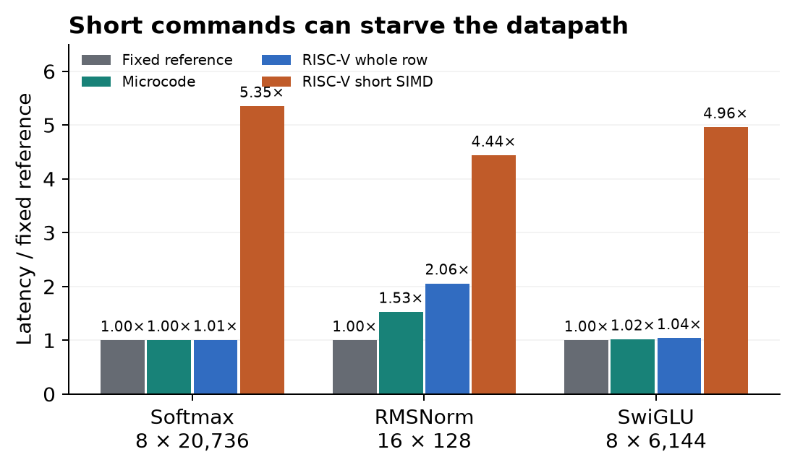
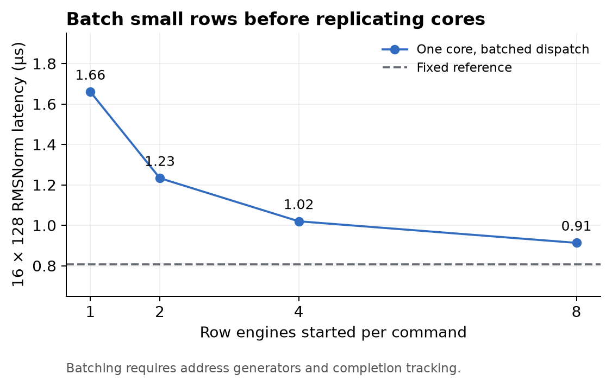
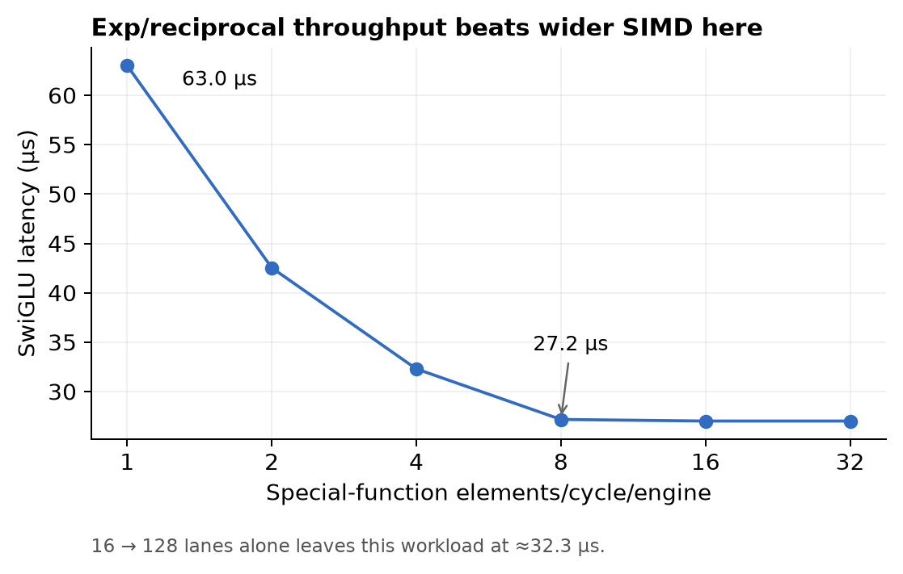
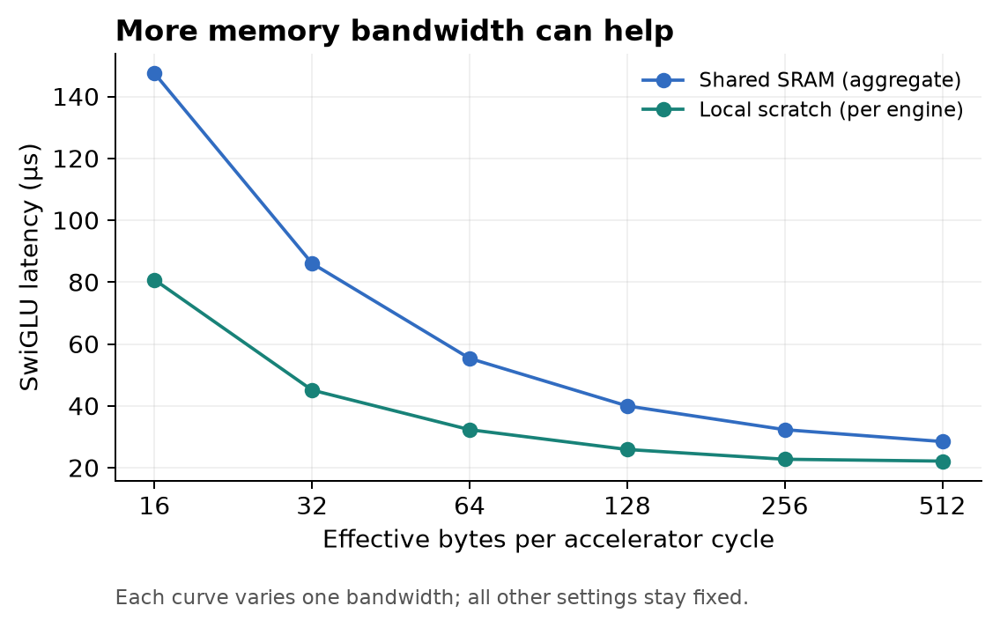
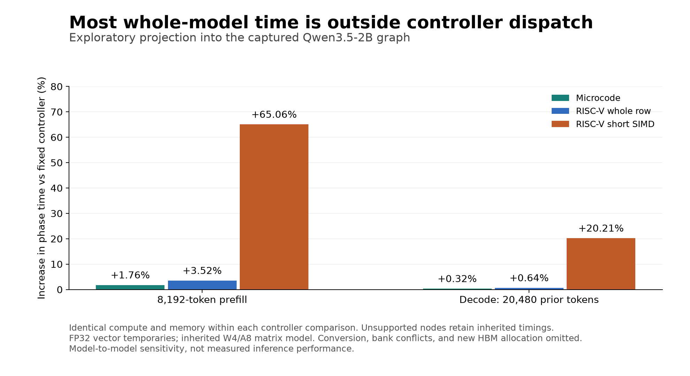

# Programmable vector control for Qwen3.5-2B

**Architecture screening study · October 2, 2026**

A small RISC-V core can sequence vector primitives to implement kernels such as softmax and SwiGLU. This study asks **how much performance that flexibility costs**, and which hardware choices reduce the overhead.

> [!IMPORTANT]
> **Analytical estimates, not measured hardware performance.** All four controllers use the same modeled arithmetic and memory resources. This study does not select a core, ISA, shared interface, compute partition, or area winner.

**Recommendation:** pursue programmable local kernel control, keeping writable microcode and a small RISC-V controller as alternatives. Make commands large enough to keep the vector datapath busy, and batch short rows before considering a CPU per engine.

| Main finding | Evidence in the reference model |
|---|---|
| **Command size matters more than the RISC-V label.** | Whole-row dispatch adds about **0.8%** to long softmax; issuing every short SIMD chunk raises latency from **95.31 to 510.14 µs**. |
| **Short rows need batching.** | Dispatching to eight row engines per command reduces RMSNorm from **1.66 to 0.91 µs**, without changing arithmetic or data traffic. |
| **More lanes are not always the useful investment.** | SwiGLU stays near **32.29 µs** from 16 to 128 lanes; special-function throughput and memory service limit this configuration. |

[Design alternatives](#1-design-alternatives) · [Kernel results](#2-kernel-results) · [Hardware tradeoffs](#3-hardware-tradeoffs) · [Whole-model projection](#4-whole-model-projection) · [Recommended direction](#5-recommended-direction) · [Model details](#6-model-details) · [Reproduce](#7-reproduce-the-study)

Related work: [architecture #8](https://github.com/SiliconBadgers/architecture/issues/8) · [RISC-V responsibility split, #7](https://github.com/SiliconBadgers/architecture/issues/7) · [Sources and related studies](#8-sources-and-related-studies).

## 1. Design alternatives

The experiment changes **how work is issued**, while holding the vector datapath and memory resources constant.

| Controller | What one issued command starts | Modeled issue cost |
|---|---|---|
| **Fixed schedule** | The fixed controller's chosen primitive sequence | Zero dispatch overhead; ideal reference |
| **Writable microcode** | One vector primitive over one row on one engine | 2 cycles per primitive per engine |
| **RISC-V, whole row** | One vector primitive over one row on one engine | 4 core cycles per primitive per engine |
| **RISC-V, short SIMD** | One lane-width chunk of a primitive on one engine | 4 core cycles per chunk per engine |

The 2- and 4-cycle issue costs are **swept assumptions**, not measurements from an implementation. The fixed reference executes the same primitive arithmetic; it is not an optimized fused softmax circuit.

Microcode is also programmable. RISC-V offers a familiar programming model and scalar control flow; it is not the only way to avoid hardcoding every activation function.

### Reference configuration

| Resource | Assumption |
|---|---|
| Vector engines | 8 engines, 32 lanes per engine |
| Controller | 1 controller; same 300 MHz clock as the datapath |
| Local scratch | 64 KiB per engine |
| Effective scratch bandwidth | 64 bytes/cycle per engine |
| Effective shared-SRAM bandwidth | 256 bytes/cycle, aggregate |
| Special-function throughput | 4 elements/cycle per engine |
| Vector temporaries | FP32 |
| Row dispatch | 1 row per command unless batching is explicitly enabled |

## 2. Kernel results

### Issue whole rows, not every short SIMD chunk



*Each bar uses identical arithmetic and memory resources. Latencies include dispatch plus datapath service; lower is better.*

| Workload: rows × elements | Fixed reference | Microcode | RISC-V whole row | RISC-V short SIMD |
|---|---:|---:|---:|---:|
| Softmax: 8 × 20,736 | 95.31 µs | 95.69 µs | **96.06 µs** | 510.14 µs |
| RMSNorm: 16 × 128 | 0.81 µs | 1.23 µs | **1.66 µs** | 3.58 µs |
| SwiGLU: 8 × 6,144 | 31.01 µs | 31.65 µs | **32.29 µs** | 153.89 µs |

Whole-row RISC-V dispatch adds about **0.8%** to the long softmax workload, but about **106%** to the short head-normalization workload. The latter is small in absolute time but can repeat many times during prefill.

**Effect of overlapping dispatch and execution.** Under ideal overlap, the whole-row softmax estimate falls to **95.38 µs** and short SIMD to **414.96 µs**. Short-SIMD issue still limits performance. These are bounds within this simplified schedule, not bounds on every possible implementation.

This result does not imply that every SIMD or standard RVV implementation is slow. Hardware loops, instruction replay, wider architectural vectors, queues, and streaming operands can avoid the naive per-chunk issue pattern tested here.

### Batch short rows before replicating cores



*Workload: 16 rows × 128 elements. One controller; unchanged arithmetic and data traffic.*

For this RMSNorm workload, one command dispatching the same primitive to eight row engines reduces whole-row RISC-V latency from **1.66 to 0.91 µs**. Eight independent issuers achieve the same dispatch amortization in this model.

| Proposed command information | Hardware it requires |
|---|---|
| Primitive and vector length | Execution of the selected operation over a whole vector |
| Source/destination addresses, row count, strides | Per-engine address generation and dispatch of identical operations across rows |
| Completion | Tracking when the dispatched work finishes |

Batching is a hardware capability, not a free software change. This study does not model instruction replay across multiple waves of rows. The proposed boundary keeps the system sequencer at kernel launch/completion, with a local controller sequencing the vector primitives.

## 3. Hardware tradeoffs

For **8 × 6,144-element SwiGLU**, increasing lanes from **16 to 128** leaves latency essentially unchanged at **32.29 µs**. In this configuration, special functions and memory service dominate.

The following sweeps change one resource at a time:

| Resource change | SwiGLU latency, before → after | Interpretation |
|---|---:|---|
| Special-function throughput: 1 → 4 elements/cycle/engine | **63.01 → 32.29 µs** | Large benefit while exp/reciprocal service dominates |
| Special-function throughput: 4 → 8 elements/cycle/engine | **32.29 → 27.17 µs** | Further benefit, then other limits dominate |
| Shared SRAM: 64 → 256 effective bytes/cycle | **55.33 → 32.29 µs** | Input/output traffic matters even with local scratch |
| Scratch capacity: 16 → 128 KiB/engine | **35.17 → 31.57 µs** | Larger tiles reduce repeated setup; bandwidth still limits service |

### Special-function throughput



*Throughput is accepted elements per cycle in the aggregate, not a count of physical units. A value of four does not specify four particular exp or reciprocal circuits.*

### Memory bandwidth



*Each curve varies one bandwidth while holding the other fixed. Shared-SRAM bandwidth is aggregate; local-scratch bandwidth is per engine.*

**These are not equal-area or equal-power comparisons.** Firmware can compose SwiGLU from reusable arithmetic, but the hardware still needs exp, reciprocal, reductions, and memory movement. Implementing them as scalar software routines would invalidate the assumed datapath service rates.

## 4. Whole-model projection

Supported vector-node timings were substituted into the captured Qwen3.5-2B graph. The table shows the change in total phase time relative to the same graph with fixed control.

| Controller | 8,192-token prefill | Decode with 20,480 prior tokens |
|---|---:|---:|
| Writable microcode | +1.76% | +0.32% |
| RISC-V whole row | **+3.52%** | **+0.64%** |
| RISC-V short SIMD | +65.06% | +20.21% |



> [!NOTE]
> Use this projection to prioritize experiments, not to forecast inference speed. It retains the inherited serial graph schedule and does not model a new overlapped accelerator pipeline.

| Projection boundary | What the estimate includes or omits |
|---|---|
| Replaced operations | 482 of 845 prefill nodes; 446 of 809 decode nodes |
| Other operations | Matrix, recurrence, convolution, RoPE, and unsupported nodes retain inherited timings |
| Precision | Inherited matrix model is W4/A8; vector scratch is FP32; conversion cost is omitted |
| Memory capacity | Local scratch is added alongside inherited shared SRAM, not carved out of an equal total budget |
| External memory | Inherited HBM spill service is retained; allocation is not recomputed |
| Fair comparison | Controllers use identical resources; buffer-capacity sweeps are not equal-area comparisons |

## 5. Recommended direction

**Keep both writable microcode and a small RISC-V controller under consideration.** The current evidence favors coarse commands and local programmability; it does not yet justify selecting a core.

| Design choice | Proposed initial approach |
|---|---|
| Command granularity | Whole-vector primitives, batched rows, and a repeat/loop mechanism for short rows |
| Intermediate values | Keep them near vector arithmetic; specify banking and bandwidth as well as capacity |
| Numerical primitives | Define throughput, latency, precision, and numerical error, especially for exp, reciprocal/rsqrt, and reductions |
| System sequencer | Launch a kernel and receive completion; let the local program select its primitive sequence |
| Controller count | Measure one controller with batched commands before considering a CPU per engine |

### Evidence needed before choosing a controller

1. **Run real instruction traces against a vector timing model.** Use the same softmax, RMSNorm, and SwiGLU programs for both programmable controllers. Measure issue gaps, dependency stalls, buffer traffic, and completed kernel cycles.
2. **Synthesize both control front ends against the same datapath and memory macros.** The present sweep cannot establish area, clock, or energy.

A new activation built from available primitives can be programmed. A new primitive, data type, or memory access pattern may still require RTL changes. Flexibility depends on the instruction set and datapath that are actually implemented.

## 6. Model details

[`model.cjs`](model.cjs) is a service-time model. Each engine processes one row at a time. Rows occupy engines in waves, with fewer active engines in the tail wave. A single row is not striped across engines.

**Not simulated:** SRAM bank conflicts, request pipeline latency, finite queues, instruction-fetch stalls, cache behavior, routing, area, DSP allocation, power, or timing closure. Effective bandwidth is an input parameter, not an assertion about attainable FPGA bandwidth. The existing CPU-to-stub integration harness does not measure these vector kernels.

<details>
<summary><strong>Stage timing and command dispatch</strong></summary>

For a stage, `N` is the element count, `L` the lane count, `E` the active-engine count, and `P` the special-function throughput.

| Component | Service-time rule |
|---|---|
| Elementwise arithmetic | `ceil(N / L) + 3` cycles |
| Special function | `ceil(N / min(P, L)) + 12` cycles |
| Reduction | `4 × ceil(N / L) + ceil(log2(L)) + 4` cycles |
| Scalar reciprocal/normalization setup | 12 cycles |
| Memory | Bytes transferred / effective bytes per cycle |
| Datapath stage | `max(arithmetic service, memory service)` |
| Conservative stage time | `service + dispatch` |
| Optimistic overlap | `max(service, dispatch)` |
| Kernel launch | 40 cycles, once per invocation |

The four-cycle reduction cadence is an assumption and is separately swept.

Whole-row dispatch is:

```text
issue cycles × ceil(ceil(E / engines-per-command) / controllers)
```

This is adjusted by the controller/datapath clock ratio. Short-SIMD dispatch additionally scales with `ceil(N / L)`, except for scalar stages. Dispatch represents assumed issue and loop bookkeeping; it is not derived from compiled firmware.

</details>

<details>
<summary><strong>Scratch residency and memory accounting</strong></summary>

| Kernel | Conservative live-buffer allocation |
|---|---|
| Softmax / SwiGLU | 4 FP32 rows |
| RMSNorm / SiLU | 3 FP32 rows |
| Sigmoid / softplus | 2 FP32 rows |

Elementwise kernels tile when necessary. Softmax and RMSNorm use an all-or-nothing full-row scratch policy. Partial caching, online softmax, fused attention, and better liveness allocation are omitted. Buffer-capacity thresholds therefore belong to this schedule, not to the algorithms in general.

| Residency | Traffic accounting |
|---|---|
| Row fits in scratch | Shared-SRAM input/output transfers charged outside stages; local reads/writes charged within each stage |
| Row does not fit | All stage reads/writes use shared SRAM |

Input/output transfers are not double-buffered.

</details>

<details>
<summary><strong>Primitive sequences and numerical limits</strong></summary>

| Kernel | Modeled sequence or boundary |
|---|---|
| Softmax | Scale/mask → max reduction → subtract → exp → sum reduction → scalar reciprocal → normalization. Scale/mask has a fused primitive cost. |
| RMSNorm | Learned scale multiplication is excluded here and modeled separately when present in the graph. |
| SwiGLU | SiLU and the gate/up multiplication. |

These are performance schedules, not numerically validated algorithms. Exp, log, and reciprocal share a throughput/latency assumption; a real implementation must distinguish them. Stable exceptional-value handling is not included.

</details>

<details>
<summary><strong>Sweep coverage and workload shapes</strong></summary>

The Cartesian sweep contains **48,600 matched configurations**, each evaluated with four controllers. This sampled design space is not a probability distribution.

| Dimension | Coverage |
|---|---|
| Kernel families | Softmax, RMSNorm, SwiGLU |
| Row lengths | 128; 2,048; 6,144; 8,192; 20,736 |
| Engines | 1 / 4 / 8 |
| Lanes per engine | 16 / 32 / 64 |
| Other Cartesian parameters | SRAM bandwidth, scratch capacity, special-function throughput, issue cost, controller count, dispatch overlap |
| Additional one-variable sweeps | Up to 16 engines and 128 lanes; local bandwidth, reduction cadence, special-function latency, controller clock ratios, batched commands |
| Prefill references | 512 and 8,192 tokens |
| Decode references | 2,048 and 20,480 prior tokens |

Prefill and decode are separate phases. The inherited graph rounds the decode attention dimension to **20,736 elements**. The 8K softmax layer reference materializes **8,192 queries × eight heads**; it is not a FlashAttention implementation.

</details>

## 7. Reproduce the study

### Run the model and checks

From this directory, with Node.js installed:

```sh
node run.cjs
node check.cjs
```

Twelve checks cover selected byte/cycle invariants, projection sanity, every CSV row, and input hashes. Passing them does not validate the architecture model against hardware.

### Regenerate the figures

With Python installed:

```sh
python3 -m venv .venv
.venv/bin/pip install -r requirements.txt
MPLCONFIGDIR=/tmp/sb-vector-matplotlib .venv/bin/python plot.py
```

| Artifact | Contents |
|---|---|
| [`results.json`](results.json) | Reference times, sensitivities, graph projections, runtime version, and SHA256 input hashes |
| [`sweep.csv.gz`](sweep.csv.gz) | Per-configuration cycle estimates in compressed CSV form |
| [Input snapshots](inputs/README.md) | Captured inputs and provenance; no live Software checkout, model weights, or original author's machine required |
| [Overview figure](overview.png) | Four kernel and hardware-sensitivity panels in one image |
| [Projection figure](projection.png) | Exploratory prefill/decode comparison |
| [Chart PDF](charts.pdf) | Both overview and projection figures for download |

The four individual kernel and sensitivity figures displayed above are also generated by [`plot.py`](plot.py). To inspect the full sweep as CSV:

```sh
gzip -dc sweep.csv.gz > sweep.csv
```

The uncompressed file is generated locally and excluded from Git.

## 8. Sources and related studies

### Relationship to the Software studies

The [Software compute-mapping index](https://github.com/SiliconBadgers/software/tree/main/research/compute-mapping) links workload evidence and the shared profiler. Eric Wang's [software #9](https://github.com/SiliconBadgers/software/pull/9) adds studies of resource sensitivity, dependency-aware scheduling, and joint matrix/SRAM/HBM allocation. At the time of this study, those reports were on [revision 72a9c1e](https://github.com/SiliconBadgers/software/tree/72a9c1e0185b4b857dcb0627f75b076fb78c29dd/research/compute-mapping) and had not merged.

| Study | Contribution |
|---|---|
| Software resource/scheduling studies | Resource sensitivity, dependency-aware scheduling, and joint memory/compute allocation |
| This vector-control study | Constant datapath across control alternatives; explicit primitive issue, short-SIMD dispatch, row batching, local scratch, and special-function service |

This study's graph projection uses the earlier serial schedule and does not incorporate Eric's scheduler. Workloads and precision assumptions differ, so the reported timings should not be compared directly. These studies complement each other; the original code and authorship remain distinct.

### Inputs and implementation references

| Source | Role in this study |
|---|---|
| [Software revision 11d36ed8](https://github.com/SiliconBadgers/software/tree/11d36ed81180607cd98e61151a403f5256eaf13b) | Basis for earlier local graph and engine snapshots, including local architecture/recurrence extensions. Input hashes identify the exact snapshots; the upstream revision alone does not. |
| [Qwen3.5-2B configuration](https://huggingface.co/Qwen/Qwen3.5-2B/blob/main/config.json) | Source of captured model dimensions |
| [Ara](https://github.com/pulp-platform/ara) | Example of a scalar RISC-V core controlling a separate vector coprocessor; not simulated here |
| [Snitch optimization guide](https://pulp-platform.github.io/snitch_cluster/ug/code_optimization.html) | Instruction issue, streaming operands, and repetition; motivates batching/replay without substituting Snitch performance into this model |
| [Vicuna](https://github.com/vproc/vicuna) | Embedded Zve32x vector coprocessor reference; its integer-only baseline is not a drop-in implementation of the assumed FP32 primitives |
